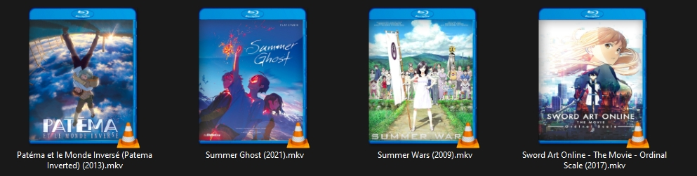
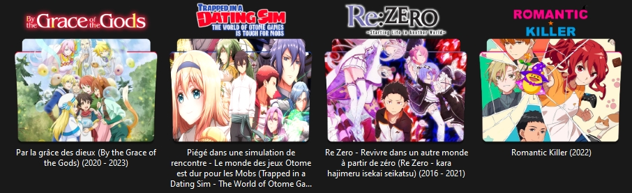

# Packs d'icone pour dossiers/vidéo
**Blu-Ray Demo :** 
**Dossier Demo :** 
**Crée par :** <Gs> Kizuna 
**Liens :** N/A 

**Informations sur le pack :**

**Liste de lien :**
* [Bonus](#bonus)
* [Dossiers Cover](#dossiers-cover)
* [Blu-Ray Cover](#blu-ray-cover)
* [Liste des Anime](#anime-liste)
* [Liste des Blu-Ray](#blu-ray-liste)

## Bonus
**Nombre Total :** 125 
**Format :** png/ico/icns/psd 
**Type :** N/A 
**Dimensions :**
* **png :** Divers (32 bits)  
* **ico :** 512x512 (32 bits), 256x256 (32 bits),
        128x128 (32 bits), 96x96 (32 bits), 72x72 (32 bits), 
        64x64 (32 bits), 48x48 (32/8 bits), 40x40 (32 bits),
        32x32 (32/8/4 bits), 24x24 (32 bits), 20x20 (32 bits), 
        16x16 (32/8/4 bits)  
* **icns :** 512x512 (png), 512x512 @x2 (png), 256x256 (png),
         256x256 @x2 (png), 128x128 (png), 128x128 @x2 (png), 
         128x128 (32 bits), 64x64 (png), 48x48 (32/8/4 bits),
         32x32 (32/8/4 bits), 32x32 (png), 32x32 @x2 (png), 
         24x24 (32 bits), 16x16 (png), 16x16 @x2 (png), 16x16 (32/8/4 bits)

## Dossiers Cover
**Nombre Total :** 1314 (219 par Format/Type) 
**Unique Anime :** 79 
**Format :** png/ico/icns 
**Type :** Normal/Gloss 
**Dimensions :**
* **png :** 512x512 (32 bits)  
* **ico :** 512x512 (32 bits), 256x256 (32 bits),
        128x128 (32 bits), 96x96 (32 bits), 72x72 (32 bits), 
        64x64 (32 bits), 48x48 (32/8 bits), 40x40 (32 bits),
        32x32 (32/8/4 bits), 24x24 (32 bits), 20x20 (32 bits), 
        16x16 (32/8/4 bits)  
* **icns :** 512x512 (png), 512x512 @x2 (png), 256x256 (png),
         256x256 @x2 (png), 128x128 (png), 128x128 @x2 (png), 
         128x128 (32 bits), 64x64 (png), 48x48 (32/8/4 bits),
         32x32 (32/8/4 bits), 32x32 (png), 32x32 @x2 (png), 
         24x24 (32 bits), 16x16 (png), 16x16 @x2 (png), 16x16 (32/8/4 bits)

## Anime Liste

**Barèmes :**

**\* :** Titre non reconnu officiellement 

| Titre Fr | Titre Jp | Titre En | Année de production | Nombre de fichier |
| --- | --- | --- | --: | :-: |
| .hack//La légende du crépuscule | .hack//Tasogare no Udewa Densetsu | .hack//Legend Of The Twilight | 2003 | 2 |
| [C] - Contrôle - L'argent et l'âme de la possibilité | N/A | [C] – Control – The Money and Soul of Possibility | 2011 | 5 |
| A.I.C.O. -Incarnation- | N/A | A.I.C.O. -Incarnation- | 2018 | 3 |
| Un couple de coucous **\*** | Kakkō no Iinazuke | A Couple Of Cuckoos | 2022 | 5 |
| Angel Beats! | Enjeru Bītsu! | Angel Beats! | 2010 | 3 |
| Arcane | N/A | Arcane | 2021 | 4 |
| Le Jeu de Bataille Dans 5 secondes **\*** | Deatte Go-byō de Batoru | Battle Game In 5 Seconds | 2021 | 2 |
| Black★Rock Shooter | Burakku★Rokku Shūtā | Black★Rock Shooter | 2012 | 3 |
| Black★★Rock Shooter: Dawn Fall | Burakku★Rokku Shūtā | Black★★Rock Shooter: Dawn Fall | 2022 | 3 |
| Bleach | Burīchi | Bleach | 2001 - 2016 | 1 |
| Par la grâce des dieux **\*** | Kami-tachi ni Hirowareta Otoko | By the Grace of the Gods | 2020 - 2023 | 5 |
| L'appel de la nuit **\*** | Yofukashi no uta | Call of the Night | 2022 | 6 |
| Chainsaw Man | Chensō Man | Chainsaw Man | 2022 | 1 |
| J'ai obtenu une compétence de triche dans un autre monde et je suis devenu imbattable dans le monde réel. **\*** | Isekai de chīto nōryoku sukiru o te ni shita ore wa, genjitsu sekai o mo musō suru 〜reberuappu wa jinsei o kaeta〜 | I Got a Cheat Skill in Another World and Became Unrivaled in the Real World, Too (Cheat Skill Level Up) | 2023 | 4 |
| Chrno Crusade | Kurono kuruseido | Chrno Crusade | 2003 - 2004 | 2 |
| La salle de classe de l'élite | Yōkoso jitsuryoku shijō shugi no kyōshitsu e | Classroom of the Elite | 2017 - 2022 | 2 |
| Claymore | Kureimoa | Claymore | 2007 | 1 |
| DanMachi : La Légende des Familias | Danjon ni deai o motomeru no wa machigatteiru darō ka | DanMachi : Familia Myth | 2015 - 2023 | 4 |
| Le Jeu de Darwin **\*** | Dāwinzugēmu | Darwin's Game | 2020 | 3 |
| Le commencement de la rhapsodie de l'autre monde à partir de la marche de la mort | Desu māchi kara hajimaru isekai kyōsōkyoku | Death March To The Parallel World Rhapsody | 2018 | 1 |
| Jeu de la mort sur le mont mort **\*** | Deddomaunto Desupurei | Dead Mount Death Play | 2023 | 2 |
| Dr. Pierre **\*** | Dokutā Sutōn | Dr. Stone | 2019 - 2023 | 2 |
| Edens Zero | Edenzu Zero | Edens Zero | 2021 - 2023 | 4 |
| Fairy Tail | Fearī Teiru | Fairy Tail | 2009 - 2019 | 5 |
| L'Alchimiste d'acier **\*** | Hagane no Renkinjutsushi - Fullmetal Alchemist | FullMetal Alchemist | 2005 - 2010 | 1 |
| École du jeu **\*** | Kakegurui | Gambling School | 2017 - 2019 | 1 |
| École du jeu - Jumelle **\*** | Kakegurui Tsuin | Gambling School - Twin | 2022 | 2 |
| Gargantia sur la planète verte **\*** | Suisei no Gargantia | Gargantia On the Verdurous Planet | 2013 | 2 |
| Gate - Au-delà de la porte | Gate Jieitai Kanochi nite, Kaku Tatakaeri | Gate | 2015 - 2016 | 2 |
| Tueur de gobelins **\*** | Goburin Sureiyā | Goblin Slayer | N/A | 3 |
| Grimgar, le Monde des Cendres et de Fantaisie **\*** | Hai to Gensō no Gurimugaru | Grimgar Ashes And Illusions | 2016 | 4 |
| Horimiya | Hori-san to Miyamura-kun | Hori-san To Miyamura-kun Horimiya | 2021 | 4 |
| Dans un autre monde avec mon Smartphone **\*** | Isekai wa Sumātofon to tomo ni. | In Another World With My Smartphone | 2017 | 2 |
| Dans le pays de Leadale **\*** | Riadeiru no daichi nite | In the Land of Leadale | 2022 | 2 |
| J'epargne 80 000 pieces d'or dans un autre monde pour ma retraite | Rōgo ni Sonaete Isekai de 8-Man-Mai no Kinka o Tamemasu | Saving 80000 Gold in Another World for my Retirement | 2023 | 2 |
| Konosuba : Sois béni monde merveilleux ! | Kono subarashii sekai ni shukufuku o! | KONOSUBA -God's blessing on this wonderful world! | 2016 - 2017| 16 |
| Kuromukuro | N/A | Kuromukuro | 2016| 3 |
| Kamisama - Opération Divine | Kaminaki Sekai no Kamisama Katsudō | KamiKatsu: Working for God in a Godless World | 2023 | 2 |
| L'attaque des Titans | Shingeki no Kyojin | Attack on Titan | 2013 - 2022 | 3 |
| La Sorcière invincible tueuse de Slime depuis 300 ans | Suraimu Taoshite Sanbyaku-nen, Shiranai Uchi ni Reberu Makkusu ni Nattemashita | I've Been Killing Slimes for 300 Years and Maxed Out My Level | 2021 | 4 |
| Les combattants seront déployés ! | Sentōin, hakenshimasu! | Combatants Will Be Dispatched! | 2021 | 2 |
| Horizon des événements **\*** | Rogu Horaizun | Log Horizon | 2013 - 2021 | 1 |
| Lookism | N/A | Lookism | 2022 | 3 |
| Lucifer et le marteau biscuit **\*** | Hoshi no Samidare | Lucifer And The Biscuit Hammer | 2022 | 2 |
| Moi Quand Je Me Reincarne En Slime | Tensei shitara Slime datta ken | That Time I Got Reincarnated as a Slime | 2018 - 2021 | 1 |
| Mashle - Magie et muscles **\*** | Masshuru | Mashle - Magic and Muscles | 2023 | 3 |
| Pas de Jeu, Pas de Vie **\*** | Nōgēmu Nōraifu | No Game No Life | 2014 | 6 |
| Une pièce **\*** | Wan Pīsu | One Piece | 1999 - 2023 | 5 |
| Seigneur suprême **\*** | Ōbārōdo | Overlord | 2015 - 2022 | 1 |
| RahXephon | Rāzefon | RahXephon | 2002 | 2 |
| Le coquin ne rêve pas de son aînée en Bunny girl | Seishun buta yarō | Rascal Does Not Dream Of Bunny Girl Senpai | 2018 | 2 |
| Re:Zero - Re vivre dans un autre monde à partir de zéro | Re:Zero - kara hajimeru isekai seikatsu | Re:Zero − Starting Life in Another World | 2016 - 2021 | 2 |
| Louez une petite amie **\*** | Kanojo, okarishimasu | Rent A Girlfriend | 2020 - 2022 | 3 |
| Tueur romantique **\*** | Romantikku Kirā | Romantic Killer | 2022 | 2 |
| Rokka -Braves des six fleurs- **\*** | Rokka no Yūsha | Rokka –Braves of the Six Flowers– | 2015 | 1 |
| Seirei Gensouki: Chroniques de l'esprit **\*** | Seirei Gensōki | Seirei Gensouki: Spirit Chronicles | 2021 | 3 |
| Elle s'est déclarée élève du sage **\*** | Kenja no Deshi o Nanoru Kenja | She Professed Herself Pupil of the Wise Man | 2022 | 4 |
| Survie dans le ciel **\*** | Tenkū shinpan | Sky-High Survival | 2021 | 2 |
| Ombres temporelles **\*** | Samā Taimu Renda | Summer Time Rendering | 2022 | 3 |
| L'Art de l'épéiste en ligne **\*** | Sōdo Āto Onrain | Sword Art Online | 2012 - 2020 | 3 |
| L'Art de l'épéiste en ligne Alternative tempête d'arme en ligne **\*** | Sōdo Āto Onrain Orutanatibu Gangeiru Onrain | Sword Art Online Alternative Gun Gale Online | 2018 | 2 |
| Si je suis la Vilaine, autant mater le Boss Final | Akuyaku Reijō Nanode Rasubosu o Katte Mimashita | I'm the Villainess, So I'm Taming the Final Boss | 2022 | 1 |
| Contes de Zestiria le X **\*** | Teiruzu Obu Zesutiria Za Kurosu | Tales of Zestiria the X | 2016 - 2017 | 1 |
| L'éminence de l'ombre **\*** | Kage no Jitsuryokusha ni Naritakute! | The Eminence in Shadow | 2022 - 2023 | 6 |
| Le paladin lointain **\*** | Saihate no Paradin | The Faraway Paladin | 2021 | 2 |
| Le dresseur de bêtes banni du groupe du héros rencontre une fille-chat de la race la plus forte | Yūsha pātī o tsuihō sa reta bīsutoteimā, saikyō-shu no nekomimi shōjo to deau | The Beast Tamer Who Was Exiled from His Party Meets a Cat Girl From the Strongest Race | 2022 | 1 |
| Le guide du prince génial pour sortir une nation de la dette (Hé, pourquoi pas la trahison) | Tensai Ōji no Akaji Kokka Saisei Jutsu ~Sō da, Baikoku Shiyō~ | The Genius Prince's - Guide to Raising a Nation Out of Debt | 2022 | 3 |
| Le plus grand seigneur des démons renaît sous la forme d'une personne ordinaire **\*** | Shijō saikyō no dai maō, murabito ē ni tensei suru | The Greatest Demon Lord Is Reborn as a Typical Nobody | 2022 | 1 |
| Le Donjon caché où moi seul peux entrer **\*** | Ore Dake Haireru Kakushi Danjon ~Kossori Kitaete Sekai Saikyō~ | The Hidden Dungeon Only I Can Enter | 2021 | 1 |
| Les Chroniques d'Idhun **\*** | N/A | The Idhun Chronicles | 2020 - 2021 | 1 |
| Le héros légendaire est mort ! **\*** | Yūsha ga Shinda! Murabito no Ore ga Hotta Otoshiana ni Yūsha ga Ochita Kekka. | The Legendary Hero is Dead! | 2023 | 3 |
| L'Inadéquat de l'Académie du Roi-Démon : Le Roi-Démon le plus fort de l'histoire se réincarne et va à l'école avec ses descendants **\*** | Maō gakuin no futekigōsha: Shijō saikyō no maō no shiso, tensei shite shison-tachi no gakkō e kayō | The Misfit of Demon King Academy: History's Strongest Demon King Reincarnates and Goes to School with His Descendants | 2020 - 2023 | 6 |
| La réincarnation de l’exorciste le plus fort dans un autre monde **\*** | Saikyō Onmyōji no Isekai Tenseiki: Geboku no Yōkai-domo ni Kurabete Monsutā ga Yowasugiru n Da ga | The Reincarnation Of The Strongest Exorcist In Another World| 2023 | 3 |
| L'Avènement du héros au Bouclier **\*** | Tate no yūsha no nariagari | The Rising Of The Shield Hero | 2019 - 2022 | 3 |
| Le sage le plus fort avec l'écusson le plus faible | Shikkakumon no Saikyō Kenja ~Sekai Saikyō no Kenja ga Sara ni Tsuyoku Naru Tame ni Tensei Shimashita~ | The Strongest Sage With the Weakest Crest | 2022 | 1 |
| Le meilleur assassin du monde se réincarne dans un autre monde en tant qu'aristocrate **\*** | Sekai Saikō no Ansatsusha, Isekai Kizoku ni Tensei suru | The World's Finest Assassin Gets Reincarnated in Another World as an Aristocrat | 2021 | 1 |
| Tomo-chan Est une Fille ! | Tomo-chan wa onnanoko! | Tomo-chan Is a Girl! | 2023 | 3 |
| TONIKAWA - La lune pour toi | Tonikaku Kawaii | TONIKAWA - Over the Moon For You | 2020 | 2 |
| Piégé dans une simulation de rencontre - Le monde des jeux Otome est dur pour les Mobs | Otomegē Sekai wa Mobu ni Kibishii Sekai Desu | Trapped in a Dating Sim - The World of Otome Games is Tough for Mobs | 2022 | 1 |

## Blu-Ray Cover
**Nombre Total :** 53 
**Format :** png 
**Type :** Normal 
**Dimensions :**
* **png :** 396x512 (32 bits)

## Blu-Ray Liste

**Barèmes :**

**\* :** Titre non reconnu officiellement

| Titre Fr | Titre Jp | Titre En | Année de sortie | Nombre de fichier |
| --- | --- | --- | --: | :-: |
| 5 centimètres par seconde | Byōsoku go senchimētoru | 5cm per second | 2007 | 1 |
| Une voix silencieuse **\*** | Koe no katachi | A Silent Voice | 2016 | 1 |
| Atlantide, L'empire Perdu | N/A | Atlantis: The Lost Empire | 2001 | 1 |
| Belle: Le dragon et la princesse aux taches de rousseur | Ryū to sobakasu no hime | Belle The Dragon and the Freckled Princess | 2021 | 6 |
| Renard noir **\*** | Black Fox | Black Fox | 2018 | 1 |
| Bulles | Baburu | Bubble | 2022 | 1 |
| Final Fantasy VII: Les enfants de l'Avent **\*** | Fainaru Fantajī Sebun Adobento Chirudoren | Final Fantasy VII - Advent Children | 2005 | 1 |
| Feux d'artifice, faut-il les voir de côté ou d'en bas ? | Uchiage Hanabi, Shita kara Miru ka? Yoko kara Miru ka? | Fireworks, Should We See It from the Side or the Bottom? | 2017 | 1 |
| Saveurs de la jeunesse | Sì shì qīngchūn / Shikioriori | Flavors Of Youth | 2018 | 1 |
| Tueur de gobelins - Couronne du gobelin **\*** | Goburin Sureiyā | Goblin Slayer - Goblin's Crown | 2020 | 1 |
| Je veux manger ton pancréas | Kimi no suizō o tabetai | I Want To Eat Your Pancreas | 2018 | 1 |
| Josée, le tigre et les poissons | Joze to tora to sakanatachi | Josee, the Tiger and the Fish | 2020 | 1 |
| Jun, la voix du cœur | Kokoro ga sakebitagatterunda | The Anthem Of The Heart | 2015 | 1 |
| KonoSuba : La bénédiction de Dieu sur ce monde merveilleux ! La légende de Crimson **\*** | Kono Subarashii Sekai ni Shukufuku wo! Kurenai Densetsu | KonoSuba: God's Blessing on This Wonderful World! Legend of Crimson |2019 | 1 |
| Le coquin ne rêve pas d'une fille rêveuse **\*** | Seishun Buta Yarou wa Bunny Girl-Senpai no Yume wo Minai | Rascal Does Not Dream of a Dreaming Girl | 2019 | 1 |
| Le Garçon et la Bête | Bakemono no ko | The Boy and the Beast | 2015 | 1 |
| Les Chevaliers du Zodiaque : La Légende du Sanctuaire | Seinto Seiya Rejendo Obu Sankuchuari | Saint Seiya: Legend of Sanctuary | 2014 | 1 |
| Les contes de Terremer | Gedo Senki | Tales from Earthsea | 2006 | 1 |
| Les Enfants de la Mer | Kaijū no kodomo | Children of the Sea | 2019 | 1 |
| Les Enfants du temps | Tenki no ko | Weathering with You | 2019 | 1 |
| Les Mondes Parallèles | Ashita sekai ga owaru to shite mo | The Relative Worlds | 2019 | 1 |
| Les Murs vagabonds | Ame o tsugeru hyōryū danchi | Drifting Home | 2022 | 1 |
| Les nouveaux héros | N/A | Big Hero 6 | 2014 | 1 |
| Loin de moi, près de toi | Nakitai Watashi wa Neko wo Kaburu | A Whisker Away | 2020 | 1 |
| Pas de jeu, pas de vie : -Zéro- | Nōgēmu Nōraifu -Zero- | No Game No Life: Zero | 2017 | 4 |
| Nos mots comme des bulles | Saidā no Yō ni Kotoba ga Wakiagaru | Words Bubble Up Like Soda Pop | 2021 | 1 |
| Origine: esprits du passé | Gin-iro no kami no Agito | Origin: Spirits of the Past | 2006 | 1 |
| Patéma et le Monde Inversé | Sakasama no Patema | Patema Inverted | 2013 | 1 |
| Princesse Mononoké | Mononoke hime | Princess Mononoke | 1997 | 5 |
| Fantôme d'été **\*** | Samā Gōsuto | Summer Ghost | 2021 | 1 |
| Guerres d'été **\*** | Samā wōzu | Summer Wars | 2009 | 4 |
| Suzume | Suzume no tojimari | Suzume | 2023 | 2 |
| Art de l'épée en ligne - Le Film - Échelle ordinaire **\*** | Gekijō-ban Sōdo Āto Onrain -Ōdinaru Sukēru- | Sword Art Online - The Movie - Ordinal Scale | 2017 | 1 |
| Art de l'épée en ligne Progressive: Air d'une nuit sans étoiles **\***| Gekijōban Sōdo Āto Onrain Puroguresshibu Hoshi-naki Yoru no Aria | Sword Art Online the Movie -Progressive- Aria of a Starless Night | 2021 | 1 |
| Le jardin des mots **\*** | Koto no ha no Niwa | The Garden of Words | 2013 | 1 |
| Titan A.E. | N/A | Titan A.E. | 2000 | 1 |
| Ton Nom. **\*** | Kimi no na wa. | Your Name. | 2016 | 1 |